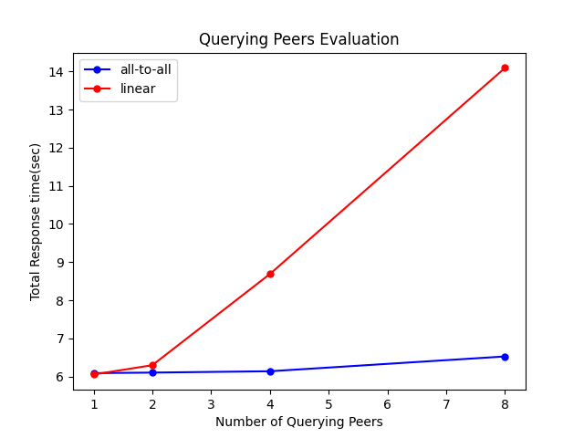

# Evaluation Report

According to the result graph, we can see that all-to-all topology is much more efficient than linear topology. Under all-to-all topology, the query messages only need on step to broadcast to all other super nodes, so the time taken by query requests doesn't increase a lot when the query messages grow. On the other hand, under linear topology, the query messages need much more steps to reach every super peers in the network which is much more inefficient. It takes a lot of time broadcasting the query messages to every super peers.
